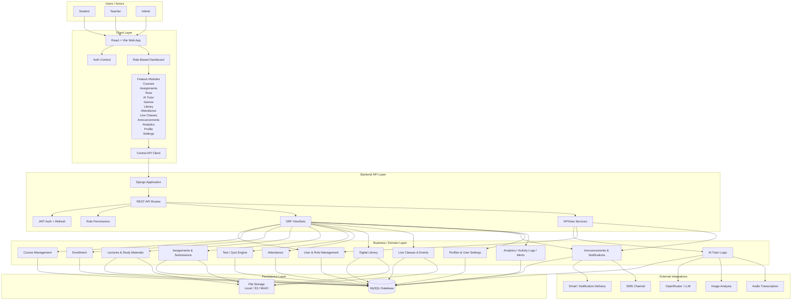
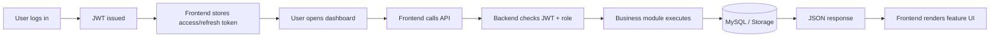
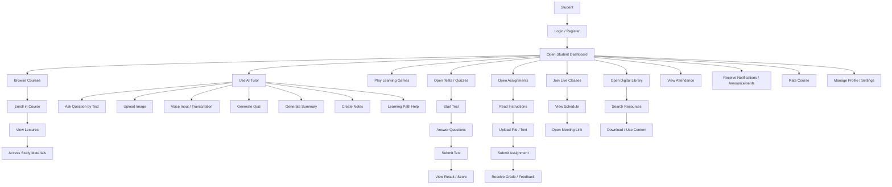
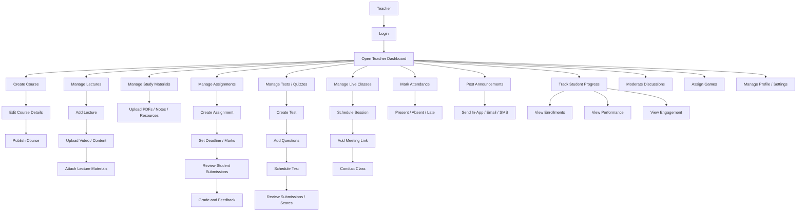
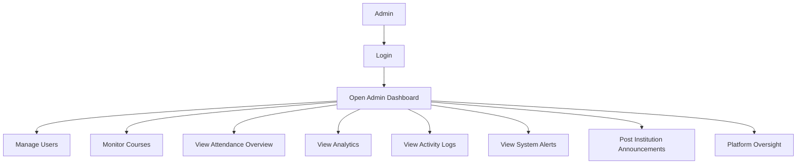
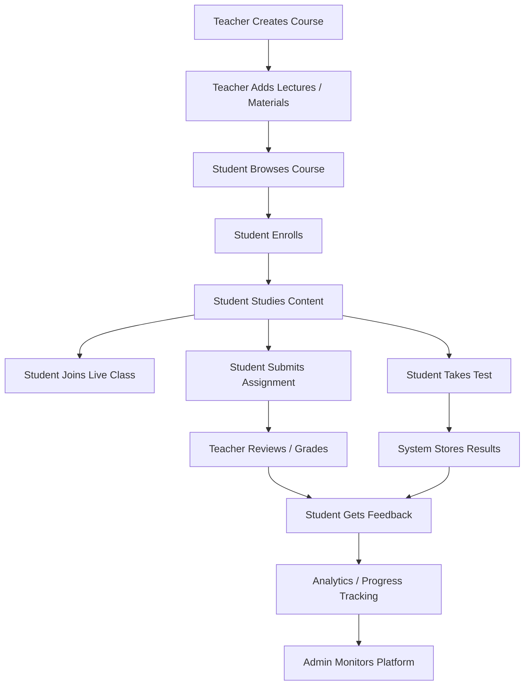

# Edusphere LMS Architecture

## Overview

Edusphere LMS is a modular monolithic learning platform built with:

- React + Vite on the frontend
- Django + Django REST Framework on the backend
- MySQL as the primary persistence layer
- local or object-based storage for uploaded media
- AI and communication integrations through backend service endpoints

The system is designed around role-based workflows for students, teachers, and administrators.

## Complete System Architecture

## System Flow

## Student Use Case

## Teacher Use Case

## Admin Use Case

## Core Academic Flow

## Backend Module Layout

- `core`
  Shared models, compatibility layer, auth views, uploads, and legacy integration points.
- `accounts`
  Route grouping for account and auth-related concerns.
- `courses`
  Course and enrollment route grouping.
- `content`
  Lectures, study materials, and content route grouping.
- `assessments`
  Assignments, tests, questions, answers, and submissions.
- `communications`
  Announcements and notifications.
- `media_assets`
  Media-oriented route grouping.
- `ai`
  AI tutor and related service endpoints.
- `forum`
  Categories, threads, posts, subscriptions, moderation, and reports.
- `games`
  Catalog, sessions, attempts, assignments, badges, and leaderboards.

## Database ERD

This ERD focuses on the major academic, discussion, and gamification relationships present in the current system.

```mermaid
erDiagram
    USER ||--o| STUDENT_PROFILE : has
    USER ||--o| TEACHER_PROFILE : has
    USER ||--o| ADMIN_PROFILE : has

    USER ||--o{ COURSE : teaches
    COURSE ||--o{ LECTURE : contains
    LECTURE ||--o{ LECTURE_MATERIAL : has
    COURSE ||--o{ STUDY_MATERIAL : has

    USER ||--o{ ENROLLMENT : owns
    COURSE ||--o{ ENROLLMENT : receives

    USER ||--o{ LECTURE_PROGRESS : tracks
    LECTURE ||--o{ LECTURE_PROGRESS : updates

    COURSE ||--o{ ASSIGNMENT : contains
    ASSIGNMENT ||--o{ ASSIGNMENT_ATTACHMENT : has
    ASSIGNMENT ||--o{ ASSIGNMENT_SUBMISSION : receives
    USER ||--o{ ASSIGNMENT_SUBMISSION : submits

    COURSE ||--o{ TEST : contains
    TEST ||--o{ QUESTION : has
    TEST ||--o{ TEST_SUBMISSION : receives
    USER ||--o{ TEST_SUBMISSION : submits
    TEST_SUBMISSION ||--o{ TEST_ANSWER : includes
    QUESTION ||--o{ TEST_ANSWER : answers

    COURSE ||--o{ ATTENDANCE_RECORD : records
    USER ||--o{ ATTENDANCE_RECORD : has

    COURSE o|--o{ LIBRARY_ITEM : references
    USER ||--o{ LIBRARY_ITEM : uploads
    USER ||--o{ LIBRARY_FAVORITE : bookmarks
    LIBRARY_ITEM ||--o{ LIBRARY_FAVORITE : saved
    USER ||--o{ LIBRARY_DOWNLOAD : downloads
    LIBRARY_ITEM ||--o{ LIBRARY_DOWNLOAD : tracked

    COURSE o|--o{ EVENT : schedules
    COURSE o|--o{ LIVE_CLASS : hosts
    USER o|--o{ LIVE_CLASS : instructs

    COURSE ||--o{ FORUM_CATEGORY : groups
    COURSE ||--o{ THREAD : contains
    FORUM_CATEGORY o|--o{ THREAD : classifies
    USER ||--o{ THREAD : creates
    THREAD ||--o{ POST : contains
    USER ||--o{ POST : writes
    POST ||--o{ REACTION : receives
    USER ||--o{ REACTION : leaves
    POST ||--o{ REPORT : reported_in
    USER ||--o{ REPORT : files
    THREAD ||--o{ THREAD_SUBSCRIPTION : followed_by
    USER ||--o{ THREAD_SUBSCRIPTION : subscribes

    GAME ||--o{ GAME_ASSIGNMENT : assigned_as
    COURSE ||--o{ GAME_ASSIGNMENT : includes
    USER o|--o{ GAME_ASSIGNMENT : creates
    GAME ||--o{ GAME_SESSION : starts
    USER ||--o{ GAME_SESSION : plays
    GAME_ASSIGNMENT o|--o{ GAME_SESSION : contextualizes
    GAME ||--o{ GAME_ATTEMPT : records
    USER ||--o{ GAME_ATTEMPT : makes
    GAME_ASSIGNMENT o|--o{ GAME_ATTEMPT : scopes
    GAME_SESSION o|--o{ GAME_ATTEMPT : contains
    GAME ||--o{ GAME_SCORE : summarizes
    USER ||--o{ GAME_SCORE : owns
    GAME ||--o{ GAME_LEADERBOARD : ranks
    USER ||--o{ GAME_LEADERBOARD : appears_on
    GAME_ASSIGNMENT o|--o{ GAME_LEADERBOARD : contextualizes
    GAME ||--o{ GAME_BADGE : awards
    USER ||--o{ GAME_BADGE : earns
```

## Architecture Notes

- The project uses a modular monolith rather than microservices.
- The frontend is being migrated toward feature-based organization with React Query and Zustand.
- `core` still retains part of the original domain ownership for compatibility and safe migration.
- forum and games are implemented as dedicated modules instead of placeholder UI sections.
