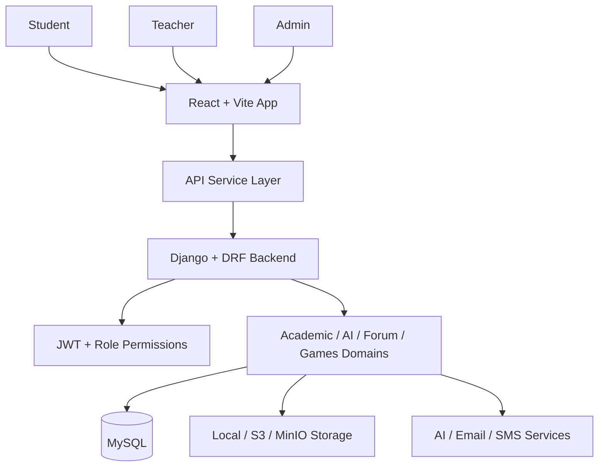

# Edusphere LMS


[](https://github.com/Sruwat/Edusphere_LMS/actions/workflows/ci.yml)
[](./frontend)
[](./backend)
[](./ARCHITECTURE.md)
[](./API.md)
[](./API.md)
[](./frontend/vercel.json)
[](./render.yaml)
[](./LICENSE)

Edusphere LMS is a full-stack, role-based academic management system built for schools, colleges, coaching institutes, academies, and training programs. It brings course management, assessments, attendance, live classes, digital library workflows, AI-assisted learning, forums, games, analytics, and institution-wide communication into one platform.

## Live Links

- Repository: [github.com/Sruwat/Edusphere_LMS](https://github.com/Sruwat/Edusphere_LMS)
- Architecture Guide: [ARCHITECTURE.md](ARCHITECTURE.md)
- API Guide: [API.md](API.md)
- Frontend Deployment Target: `Vercel` via [frontend/vercel.json](frontend/vercel.json)
- Backend Deployment Target: `Render` via [render.yaml](render.yaml)
- Live frontend demo: add your Vercel domain here after deployment
- Live backend API: add your Render domain here after deployment
- Live Swagger docs: `https://your-backend-domain/api/docs/`

## Why This Project Stands Out

Most academic systems stop at CRUD-style course management. Edusphere is designed more like an academic operating system:

- multi-role dashboards for students, teachers, and admins
- structured course, lecture, assignment, and test workflows
- AI tutor support for guided learning
- library, discussion, notification, and live-class flows in one product
- gamified engagement through an integrated games module
- modular backend architecture with documented APIs

## Product Snapshot

### Users

- Students
- Teachers
- Admins

### Main Modules

- Authentication and role-based access
- Courses, lectures, study materials, and enrollment
- Assignments, submissions, grading, and feedback
- Tests, quizzes, answers, and results
- Attendance tracking
- Digital library and media uploads
- Live classes and events
- Announcements and notifications
- AI tutor workflows
- Discussion forum
- Educational games, leaderboards, and assignments
- Analytics, activity logs, and settings

## Architecture At A Glance



For the complete architecture diagrams, system design notes, and database ERD, see [ARCHITECTURE.md](ARCHITECTURE.md).

## Screenshot Gallery

The repo currently includes the product banner and is ready for a full screenshot gallery. To complete this section, add your UI screenshots into `docs/screenshots/` with the names below and replace the placeholders with image embeds.

Recommended gallery set:

- `student-dashboard.png`
- `teacher-dashboard.png`
- `admin-dashboard.png`
- `course-creation.png`
- `lecture-creation.png`
- `library-module.png`
- `forum-module.png`
- `games-hub.png`

Suggested gallery layout:

| View | Planned File |
| --- | --- |
| Student Dashboard | `docs/screenshots/student-dashboard.png` |
| Teacher Dashboard | `docs/screenshots/teacher-dashboard.png` |
| Admin Dashboard | `docs/screenshots/admin-dashboard.png` |
| Course Creation | `docs/screenshots/course-creation.png` |
| Lecture Creation | `docs/screenshots/lecture-creation.png` |
| Library Module | `docs/screenshots/library-module.png` |
| Discussion Forum | `docs/screenshots/forum-module.png` |
| Games Hub | `docs/screenshots/games-hub.png` |

## Core Use Cases

### Student

- enroll in courses
- attend lectures and live sessions
- submit assignments
- take quizzes and tests
- use AI tutor tools
- access digital library resources
- join course discussions
- play educational games

### Teacher

- create and publish courses
- manage lectures and materials
- create assignments and tests
- grade student work
- schedule live classes
- moderate discussion threads
- assign games to courses
- post announcements

### Admin

- manage users and platform oversight
- monitor analytics, alerts, and activity logs
- publish institution-wide announcements
- review system-level operational health

## Tech Stack

### Frontend

- React
- Vite
- React Router
- TanStack Query
- Zustand

### Backend

- Django
- Django REST Framework
- Simple JWT
- drf-spectacular
- django-filter

### Data And Storage

- MySQL
- SQLite for tests
- Local media storage
- Optional S3 / MinIO object storage

## Documentation

- [ARCHITECTURE.md](ARCHITECTURE.md)
  Full system design, role flows, Mermaid diagrams, backend module layout, architectural notes, and database ERD.
- [API.md](API.md)
  API structure, auth flow, key route groups, local docs endpoints, and backend integration notes.

## API Docs

When the backend is running locally:

- Swagger UI: `http://127.0.0.1:8000/api/docs/`
- ReDoc: `http://127.0.0.1:8000/api/redoc/`
- Schema: `http://127.0.0.1:8000/api/schema/`

## Local Setup

### 1. Clone The Repository

```powershell
git clone https://github.com/Sruwat/Edusphere_LMS.git
cd Edusphere_LMS
```

### 2. Configure The Backend

```powershell
cd backend
Copy-Item .env.example .env
python -m venv .venv
.\.venv\Scripts\Activate.ps1
pip install -r requirements.txt
```

Set your environment values in `backend/.env`, especially:

- `DJANGO_SECRET_KEY`
- `DB_NAME`
- `DB_USER`
- `DB_PASSWORD`
- `DB_HOST`
- `DB_PORT`

### 3. Run Migrations And Seed Demo Data

```powershell
.\.venv\Scripts\python.exe .\sarasedu_backend\manage.py migrate
.\.venv\Scripts\python.exe .\sarasedu_backend\manage.py seed_db
```

### 4. Start The Backend

```powershell
$env:DJANGO_SECRET_KEY="your-secret-key"
.\.venv\Scripts\python.exe .\sarasedu_backend\manage.py runserver 8000
```

### 5. Start The Frontend

```powershell
cd ..\frontend
npm install
npm run dev
```

## Demo Credentials

After `seed_db`:

- Admin: `admin@sarasedu.com` / `adminpass`
- Teacher: `sarah.johnson@sarasedu.com` / `teacherpass`
- Teacher: `michael.chen@sarasedu.com` / `teacherpass`
- Student: `john.doe@student.com` / `studentpass`
- Student: `jane.smith@student.com` / `studentpass`

Login supports both email and username.

## Quality Checks

### Backend

```powershell
cd backend
$env:DJANGO_SECRET_KEY="your-secret-key"
.\.venv\Scripts\python.exe .\sarasedu_backend\manage.py check
.\.venv\Scripts\python.exe .\sarasedu_backend\manage.py test
```

### Frontend

```powershell
cd frontend
npm test
npm run build
```

## Repository Structure

```text
Edusphere_LMS/
+-- backend/
|   +-- sarasedu_backend/
|   |   +-- accounts/
|   |   +-- ai/
|   |   +-- assessments/
|   |   +-- communications/
|   |   +-- content/
|   |   +-- core/
|   |   +-- courses/
|   |   +-- forum/
|   |   +-- games/
|   |   +-- media_assets/
|   |   +-- sarasedu_backend/
|   +-- requirements.txt
+-- frontend/
|   +-- src/
|   |   +-- app/
|   |   +-- components/
|   |   +-- contexts/
|   |   +-- features/
|   |   +-- lib/
|   |   +-- services/
|   |   +-- stores/
|   +-- package.json
+-- ARCHITECTURE.md
+-- API.md
+-- render.yaml
+-- README.md
```

## Notes

- The backend is evolving as a modular monolith.
- `core` still acts as a compatibility layer for parts of the existing data model.
- frontend server-state management now uses React Query, while app-level client state uses Zustand.
- forum and games are now first-class product modules.

## License

This project is released under the MIT License. See [LICENSE](LICENSE).
