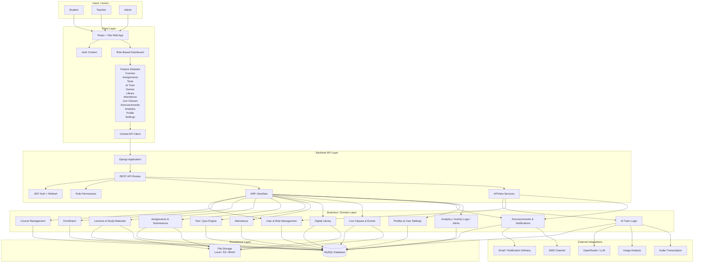
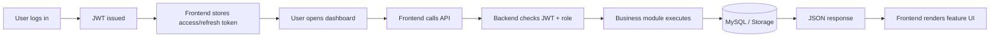
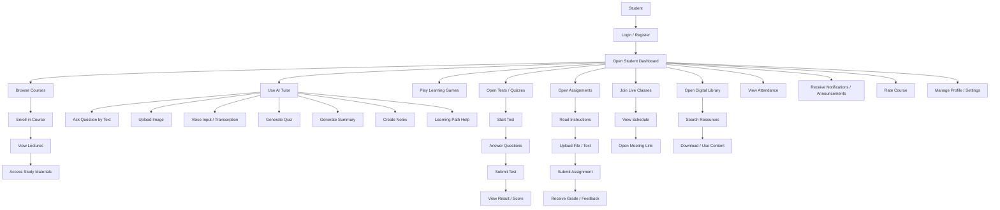
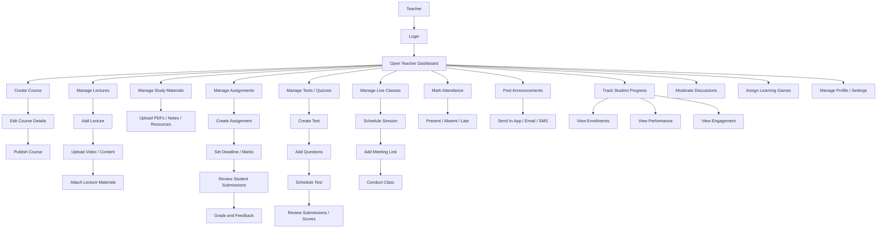
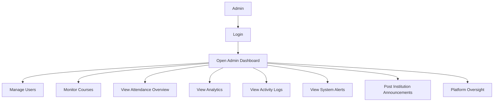
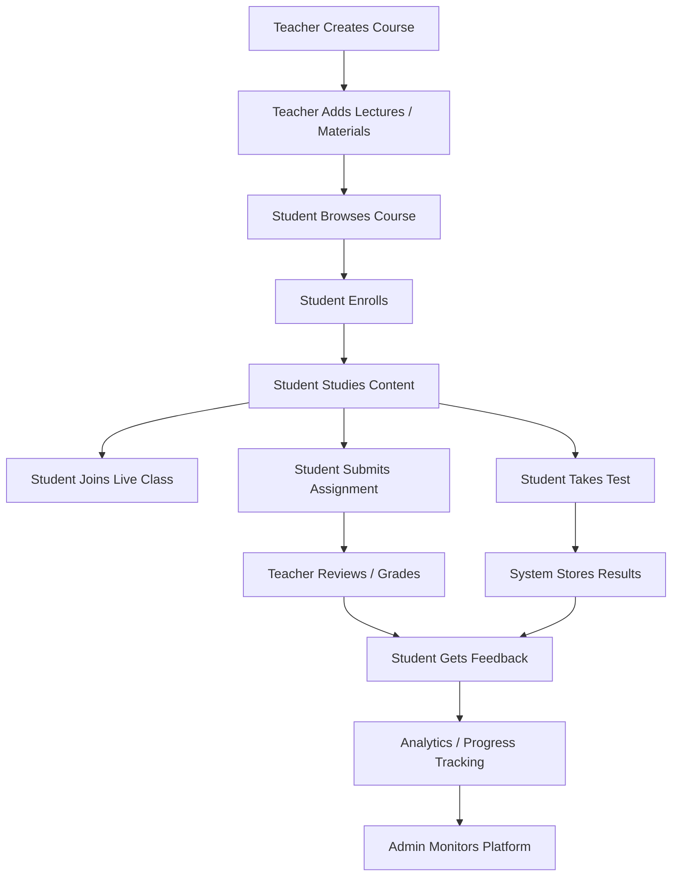

# Edusphere LMS

Edusphere LMS is a role-based academic management platform for schools, colleges, coaching institutes, academies, and training programs. It combines course delivery, assignments, tests, attendance, live classes, digital library workflows, announcements, analytics, discussion forums, educational games, and AI-assisted learning inside one system.

The project uses a React + Vite frontend and a Django + Django REST Framework backend, backed by MySQL for academic data and local or object storage for uploaded media.

## One-Line Summary

Edusphere LMS is a modular monolithic, full-stack learning platform where a React frontend talks to a Django REST backend that manages courses, assessments, attendance, communication, AI tutor workflows, library resources, discussions, and gamified learning.

## Table Of Contents

- [Product Overview](#product-overview)
- [Core Capabilities](#core-capabilities)
- [Technology Stack](#technology-stack)
- [System Design](#system-design)
- [System Architecture](#system-architecture)
- [Application Flow](#application-flow)
- [Use Cases](#use-cases)
- [Backend Module Layout](#backend-module-layout)
- [API Documentation](#api-documentation)
- [Project Structure](#project-structure)
- [Local Setup](#local-setup)
- [Environment Notes](#environment-notes)
- [Demo Credentials](#demo-credentials)
- [Quality Checks](#quality-checks)
- [Current Architecture Notes](#current-architecture-notes)
- [Roadmap Direction](#roadmap-direction)
- [License](#license)

## Product Overview

Edusphere is designed to replace fragmented academic tooling with one connected platform.

Students can:
- browse and enroll in courses
- access lectures and study materials
- submit assignments
- take quizzes and tests
- use the AI tutor
- join live classes
- access library resources
- participate in discussions
- play educational games
- track attendance, notifications, and profile settings

Teachers can:
- create and publish courses
- upload lectures and materials
- manage assignments and tests
- grade work
- schedule live sessions
- post announcements
- moderate discussions
- assign games to courses
- monitor student engagement and outcomes

Admins can:
- manage users and platform oversight
- review analytics, activity logs, and alerts
- monitor institution-wide operations
- publish announcements

## Core Capabilities

- Multi-role authentication: student, teacher, admin
- JWT login and refresh flows
- Course creation, publishing, and enrollment
- Lecture and study material management
- Assignment creation, submission, and grading
- Test and quiz engine
- Attendance management
- Digital library with downloads and media support
- Live classes and events
- Announcements and notifications
- AI tutor workflows
- Discussion forum module
- Games hub with leaderboard and assignment support
- User profiles and settings
- Activity logging and analytics-oriented modules
- Swagger / OpenAPI documentation

## Technology Stack

### Frontend

- React
- Vite
- React Router
- TanStack Query
- Zustand
- Tailwind-based UI component structure

### Backend

- Django
- Django REST Framework
- Simple JWT
- drf-spectacular
- django-filter

### Data And Storage

- MySQL for primary application data
- SQLite for tests
- Local media storage by default
- Optional S3 / MinIO object storage

### External Service Hooks

- LLM integration layer for AI tutor workflows
- image analysis hooks
- audio transcription hooks
- email delivery
- SMS-capable announcement channel abstraction

## System Design

This LMS is implemented as a modular monolith.

- The frontend is a single-page React application with role-based dashboards and feature modules.
- The backend is a Django application exposing REST APIs through DRF viewsets and APIViews.
- JWT is used for authentication and protected API access.
- Business domains are being separated into focused backend apps while preserving compatibility with the existing data model.
- Uploaded files are stored in local media or object storage.
- AI-assisted workflows are exposed through backend service endpoints rather than directly from the frontend.

## System Architecture

Below is the complete architecture view of the system.



## Application Flow

This is the high-level request and response lifecycle.



## Use Cases

### Student Use Case



### Teacher Use Case



### Admin Use Case



### Core Academic Flow



## Backend Module Layout

The backend is now organized around domain-focused modules while keeping compatibility with the existing data model.

- `core`
  Compatibility layer, shared models, serializers, legacy integration points, auth flows, uploads, and common viewsets.
- `accounts`
  Auth and user-facing account route grouping.
- `courses`
  Course and enrollment route grouping.
- `content`
  Lectures, materials, and academic content route grouping.
- `assessments`
  Assignments, tests, submissions, answers, and grading route grouping.
- `communications`
  Announcements, notifications, and messaging-related route grouping.
- `media_assets`
  Media upload and storage route grouping.
- `ai`
  AI tutor and AI service route grouping.
- `forum`
  Discussion categories, threads, posts, reports, moderation, and subscriptions.
- `games`
  Game catalog, sessions, attempts, assignments, badges, and leaderboards.

## API Documentation

The backend exposes OpenAPI documentation via `drf-spectacular`.

- Swagger UI: `http://127.0.0.1:8000/api/docs/`
- ReDoc: `http://127.0.0.1:8000/api/redoc/`
- Schema: `http://127.0.0.1:8000/api/schema/`

Key API areas include:

- `/api/auth/...`
- `/api/courses/...`
- `/api/library...`
- `/api/assignments/...`
- `/api/tests/...`
- `/api/forum/...`
- `/api/games/...`
- `/api/announcements/...`
- `/api/notifications/...`

## Project Structure

```text
Edusphere_LMS/
├── backend/
│   ├── sarasedu_backend/
│   │   ├── accounts/
│   │   ├── ai/
│   │   ├── assessments/
│   │   ├── communications/
│   │   ├── content/
│   │   ├── core/
│   │   ├── courses/
│   │   ├── forum/
│   │   ├── games/
│   │   ├── media_assets/
│   │   └── sarasedu_backend/
│   ├── requirements.txt
│   └── docker-compose.yml
├── frontend/
│   ├── src/
│   │   ├── app/
│   │   ├── components/
│   │   ├── contexts/
│   │   ├── features/
│   │   ├── lib/
│   │   ├── services/
│   │   └── stores/
│   ├── package.json
│   └── vite.config.js
└── README.md
```

## Local Setup

### 1. Clone The Repository

```powershell
git clone https://github.com/Sruwat/Edusphere_LMS.git
cd Edusphere_LMS
```

### 2. Prepare MySQL

Create a MySQL database named `sarasedu`.

```sql
CREATE DATABASE IF NOT EXISTS sarasedu CHARACTER SET utf8mb4 COLLATE utf8mb4_unicode_ci;
CREATE USER IF NOT EXISTS 'sarasedu'@'localhost' IDENTIFIED BY 'your-app-password';
ALTER USER 'sarasedu'@'localhost' IDENTIFIED BY 'your-app-password';
GRANT ALL PRIVILEGES ON sarasedu.* TO 'sarasedu'@'localhost';
FLUSH PRIVILEGES;
```

### 3. Configure The Backend Environment

```powershell
cd backend
Copy-Item .env.example .env
```

Set at minimum:

- `DJANGO_SECRET_KEY`
- `DB_NAME`
- `DB_USER`
- `DB_PASSWORD`
- `DB_HOST`
- `DB_PORT`
- `ALLOWED_HOSTS`
- `CORS_ALLOWED_ORIGIN`
- `CSRF_TRUSTED_ORIGINS`

Recommended local frontend origin:

- `http://localhost:5000`
- `http://127.0.0.1:5000`

### 4. Create And Activate The Python Environment

```powershell
python -m venv .venv
.\.venv\Scripts\Activate.ps1
```

### 5. Install Backend Dependencies

```powershell
pip install -r requirements.txt
```

### 6. Apply Migrations

```powershell
.\.venv\Scripts\python.exe .\sarasedu_backend\manage.py migrate
```

### 7. Seed Demo Data

```powershell
.\.venv\Scripts\python.exe .\sarasedu_backend\manage.py seed_db
```

### 8. Start The Backend

```powershell
$env:DJANGO_SECRET_KEY="your-secret-key"
.\.venv\Scripts\python.exe .\sarasedu_backend\manage.py runserver 8000
```

### 9. Install Frontend Dependencies

```powershell
cd ..\frontend
npm install
```

### 10. Start The Frontend

```powershell
npm run dev
```

## Environment Notes

### Local URLs

- Frontend: `http://127.0.0.1:5000`
- Backend root: `http://127.0.0.1:8000/`
- Backend API: `http://127.0.0.1:8000/api/`
- Swagger docs: `http://127.0.0.1:8000/api/docs/`

### Authentication Notes

- Login supports both `username` and `email`
- JWT access and refresh tokens are used for API access
- frontend auth state is coordinated through AuthContext plus Zustand-backed state

### Storage Notes

- Local development uses filesystem storage by default
- object storage can be enabled through environment configuration
- course and library thumbnails support uploaded media in addition to legacy URL-based compatibility

## Demo Credentials

After running `seed_db`, these demo accounts are available:

- Admin: `admin@sarasedu.com` / `adminpass`
- Teacher: `sarah.johnson@sarasedu.com` / `teacherpass`
- Teacher: `michael.chen@sarasedu.com` / `teacherpass`
- Student: `john.doe@student.com` / `studentpass`
- Student: `jane.smith@student.com` / `studentpass`

## Quality Checks

### Backend

```powershell
cd backend
$env:DJANGO_SECRET_KEY="your-secret-key"
.\.venv\Scripts\python.exe .\sarasedu_backend\manage.py check
.\.venv\Scripts\python.exe .\sarasedu_backend\manage.py test
```

### Frontend

```powershell
cd frontend
npm test
npm run build
```

## Current Architecture Notes

- The project is intentionally evolving as a modular monolith instead of being broken into microservices.
- `core` still acts as a compatibility layer for several existing models and shared behaviors.
- Route ownership and feature ownership have been split into dedicated apps and frontend feature modules.
- The forum and games modules are now first-class parts of the product, not placeholders.
- React Query and Zustand have been introduced as the frontend state foundation, while older components are being migrated incrementally.

## Roadmap Direction

Likely next architecture improvements:

- continue extracting model ownership from `core` where safe
- increase test coverage for new modules
- harden production deployment and secrets management
- improve bundle splitting for large frontend chunks
- deepen analytics and teacher reporting
- expand game catalog and richer forum moderation UX

## License

This project is released under the MIT License. See [LICENSE](LICENSE).
